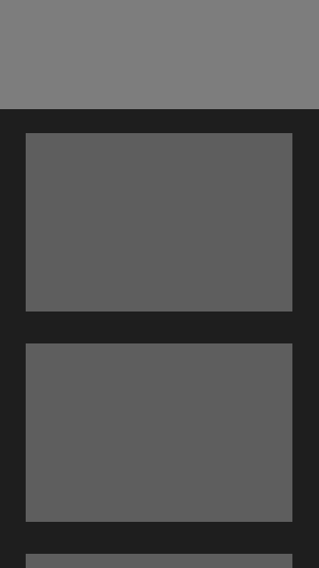
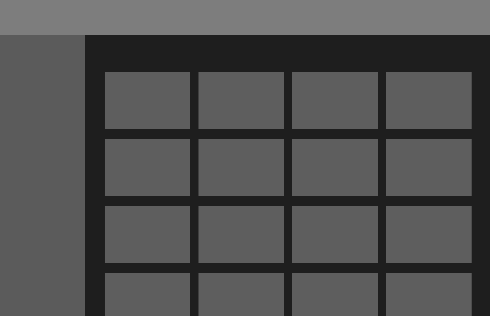

# academy-template-readme-projects


<p align="center">
  

  
  
  <a href="https://github.com/cubos-academy/academy-template-readme-projects/commits/main">
    
  </a>
  
  
  
   <a href="https://cubos.academy/">
    
   </a>
   
   <a href="https://github.com/cubos-academy/academy-template-readme-projects/stargazers">
    
  </a>
  
   <a href="https://www.twitter.com/cubosacademy/">
    
  </a>
  
 
</p>
<h1 align="center">
    
</h1>

<h4 align="center"> 
	🚧  Nome do Projeto 📄 Status do Projeto ✨ 🚧
</h4>

<p align="center">
 <a href="#-sobre-o-projeto">Sobre</a> •
 <a href="#-funcionalidades">Funcionalidades</a> •
 <a href="#-layout">Layout</a> • 
 <a href="#-como-executar-o-projeto">Como executar</a> • 
 <a href="#-tecnologias">Tecnologias</a> • 
 <a href="#-contribuidores">Contribuidores</a> • 
 <a href="#-autor">Autor</a> • 
 <a href="#user-content--licença">Licença</a>
</p>


## 💻 Sobre o projeto

📄 Academy Template README Projects - é o modelo oficial de README de projetos da Cubos Academy.


Projeto desenvolvido durante a **[Turma | Evento]** oferecida pela [Cubos Academy](https://cubos.academy/).

A Cubos Academy é uma escola com cursos de tecnologia para todos os perfis, do iniciante ao avançado.

---

## ⚙️ Funcionalidades

- [x] Funcionalidade 1:
  - [x] Entidade 1
  - [x] Entidade 2
  - [x] Entidade 3
  - [x] Entidade 4: 
    - Item 1
    - Item 2

- [x] Funcionalidade 1:
  - [x] Entidade 1
  - [x] Entidade 2

---

## 🎨 Layout

O layout da aplicação está disponível no Figma:

<a href="https://www.figma.com/files/project/77994470/%F0%9F%93%84-Templates-para-Projetos%2C-Eventos-e-Cursos?fuid=1110596132085818429">
  
</a>


### Mobile

<p align="center">
  

  
</p>

### Web

<p align="center" style="display: flex; align-items: flex-start; justify-content: center;">
  

  
</p>

---

## 🛣️ Como executar o projeto

Este projeto é divido em três partes:
1. Backend (pasta server) 
2. Frontend (pasta web)
3. Mobile (pasta mobile)

💡Tanto o Frontend quanto o Mobile precisam que o Backend esteja sendo executado para funcionar.

### Pré-requisitos

Antes de começar, você vai precisar ter instalado em sua máquina as seguintes ferramentas:
[Git](https://git-scm.com), [Node.js](https://nodejs.org/en/). 
Além disto é bom ter um editor para trabalhar com o código como [VSCode](https://code.visualstudio.com/)

#### 🎲 Rodando o Backend (servidor)

```bash

# Clone este repositório
$ git clone git@github.com:cubos-academy/academy-template-readme-projects.git

# Acesse a pasta do projeto no terminal/cmd
$ cd academy-template-readme-projects

# Vá para a pasta server
$ cd server

# Instale as dependências
$ npm install

# Execute a aplicação em modo de desenvolvimento
$ npm run dev:server

# O servidor inciará na porta:3333 - acesse http://localhost:3333 

```
<p align="center">
  <a href="https://github.com/cubos-academy/academy-template-readme-projects" target="_blank"></a>
</p>


#### 🧭 Rodando a aplicação web (Frontend)

```bash

# Clone este repositório
$ git clone git@github.com:cubos-academy/academy-template-readme-projects.git

# Acesse a pasta do projeto no seu terminal/cmd
$ cd academy-template-readme-projects

# Vá para a pasta da aplicação Front End
$ cd web

# Instale as dependências
$ npm install

# Execute a aplicação em modo de desenvolvimento
$ npm run start

# A aplicação será aberta na porta:3000 - acesse http://localhost:3000

```

---

## 🛠 Tecnologias

As seguintes ferramentas foram usadas na construção do projeto:

#### **Website**  ([React](https://reactjs.org/)  +  [TypeScript](https://www.typescriptlang.org/))

-   **[React Icons](https://react-icons.github.io/react-icons/)**
-   **[Axios](https://github.com/axios/axios)**

> Veja o arquivo  [package.json](https://github.com/cubos-academy/academy-template-readme-projects/blob/master/web/package.json)

#### [](https://github.com/cubos-academy/academy-template-readme-projects#server-nodejs--typescript)**Server**  ([NodeJS](https://nodejs.org/en/)  +  [TypeScript](https://www.typescriptlang.org/))

-   **[Express](https://expressjs.com/)**
-   **[CORS](https://expressjs.com/en/resources/middleware/cors.html)**
-   **[KnexJS](http://knexjs.org/)**
-   **[SQLite](https://github.com/mapbox/node-sqlite3)**
-   **[ts-node](https://github.com/TypeStrong/ts-node)**
-   **[dotENV](https://github.com/motdotla/dotenv)**

> Veja o arquivo  [package.json](https://github.com/cubos-academy/academy-template-readme-projects/blob/master/web/package.json)

#### [](https://github.com/cubos-academy/academy-template-readme-projects#mobile-flutter--typescript)**Mobile**  ([Flutter](https://flutter.dev/)  +  [TypeScript](https://www.typescriptlang.org/))

-   **[Flutter](https://flutter.dev/)**

> Veja o arquivo  [package.json](https://github.com/cubos-academy/academy-template-readme-projects/blob/master/mobile/package.json)

#### [](https://github.com/cubos-academy/academy-template-readme-projects#utilit%C3%A1rios)**Utilitários**

-   Protótipo:  **[Figma](https://www.figma.com/)**  →  **[Protótipo](https://www.figma.com/file/L4O2dxZzKKhEPspDgxzZ3a/Template-de-Capa-para-Projetos?type=design&node-id=0%3A1&t=zpQ8tnlNEfQtMeC8-1)**
-   API:  **[API](Link da API)**
-   Editor:  **[Visual Studio Code](https://code.visualstudio.com/)**  → Extensions:  **[SQLite](https://marketplace.visualstudio.com/items?itemName=alexcvzz.vscode-sqlite)**
-   Markdown:  **[StackEdit](https://stackedit.io/)**,  **[Markdown Emoji](https://gist.github.com/rxaviers/7360908)**
-   Commit Conventional:  **[Commitlint](https://github.com/conventional-changelog/commitlint)**
-   Teste de API:  **[Insomnia](https://insomnia.rest/)**
-   Ícones:  **[Feather Icons](https://feathericons.com/)**,  **[Font Awesome](https://fontawesome.com/)**
-   Fontes:  **[Ubuntu](https://fonts.google.com/specimen/Ubuntu)**,  **[Roboto](https://fonts.google.com/specimen/Roboto)**


---

## 👨‍💻 Contribuidores

Um praise para os cúbicos que contribuíram neste projeto 👏

<table>
  <tr>
    <td align="center"><a href="https://rocketseat.com.br"><br /><sub><b>Diego Fernandes</b></sub></a><br /><a href="https://rocketseat.com.br/" title="Rocketseat">👨‍🚀</a></td>
    <td align="center"><a href="https://rocketseat.com.br"><br /><sub><b>Cleiton Souza</b></sub></a><br /><a href="https://rocketseat.com.br/" title="Rocketseat">👨‍🚀</a></td>
    <td align="center"><a href="https://rocketseat.com.br"><br /><sub><b>Robson Marques</b></sub></a><br /><a href="https://rocketseat.com.br/" title="Rocketseat">👨‍🚀</a></td>
    <td align="center"><a href="https://rocketseat.com.br"><br /><sub><b>Claudio Orlandi</b></sub></a><br /><a href="https://rocketseat.com.br/" title="Rocketseat">🚀</a></td>
    <td align="center"><a href="https://rocketseat.com.br"><br /><sub><b>Vinícios Fraga</b></sub></a><br /><a href="https://rocketseat.com.br/" title="Rocketseat">🚀</a></td>
    <td align="center"><a href="https://rocketseat.com.br"><br /><sub><b>Hugo Duarte</b></sub></a><br /><a href="https://rocketseat.com.br/" title="Rocketseat">🚀</a>  <a href="https://blog.rocketseat.com.br/" title="Blog">🌐</a></td>
    
  </tr>
  <tr>
    <td align="center"><a href="https://rocketseat.com.br"><br /><sub><b>Joseph Oliveira</b></sub></a><br /><a href="https://rocketseat.com.br/" title="Rocketseat">🚀</a></td>
    <td align="center"><a href="https://rocketseat.com.br"><br /><sub><b>Guilherme Rodz</b></sub></a><br /><a href="https://rocketseat.com.br/" title="Rocketseat">🚀</a></td>
    <td align="center"><a href="https://rocketseat.com.br"><br /><sub><b>Mayk Brito</b></sub></a><br /><a href="https://rocketseat.com.br/" title="Rocketseat">🚀</a></td>
    <td align="center"><a href="https://rocketseat.com.br"><br /><sub><b>João Paulo</b></sub></a><br /><a href="https://rocketseat.com.br/" title="Rocketseat">🚀</a></td>
    <td align="center"><a href="https://rocketseat.com.br"><br /><sub><b>Luke Morales</b></sub></a><br /><a href="https://rocketseat.com.br/" title="Rocketseat">🚀</a></td>
     <td align="center"><a href="https://rocketseat.com.br"><br /><sub><b>Luiz Batanero</b></sub></a><br /><a href="https://rocketseat.com.br/" title="Rocketseat">🚀</a></td>
    
  </tr>
</table>

## 💪 Como contribuir para o projeto

1. Faça um **fork** do projeto.
2. Crie uma nova branch com as suas alterações: `git checkout -b my-feature`
3. Salve as alterações e crie uma mensagem de commit contando o que você fez: `git commit -m "feature: My new feature"`
4. Envie as suas alterações: `git push origin my-feature`
> Caso tenha alguma dúvida confira este [guia de como contribuir no GitHub](./CONTRIBUTING.md)

---

## 🦸 Autor

<a href="https://blog.rocketseat.com.br/author/thiago/">
 
 <br />
 <sub><b>Thiago Marinho</b></sub></a> <a href="https://blog.rocketseat.com.br/author/thiago/" title="Rocketseat">🚀</a>
 <br />

[](https://twitter.com/tgmarinho) [](https://www.linkedin.com/in/tgmarinho/) 
[](mailto:tgmarinho@gmail.com)

---

## 📝 Licença

Este projeto esta sobe a licença [MIT](./LICENSE).

Feito com ❤️ por Thiago Marinho 👋🏽 [Entre em contato!](https://www.linkedin.com/in/tgmarinho/)

---

##  Versões do README

[Português 🇧🇷](./README.md)  |  [Inglês sem emojis 🇺🇸](./README-en.md) | [Portugues sem logo  🇧🇷](./README-sem-logo.md) 

